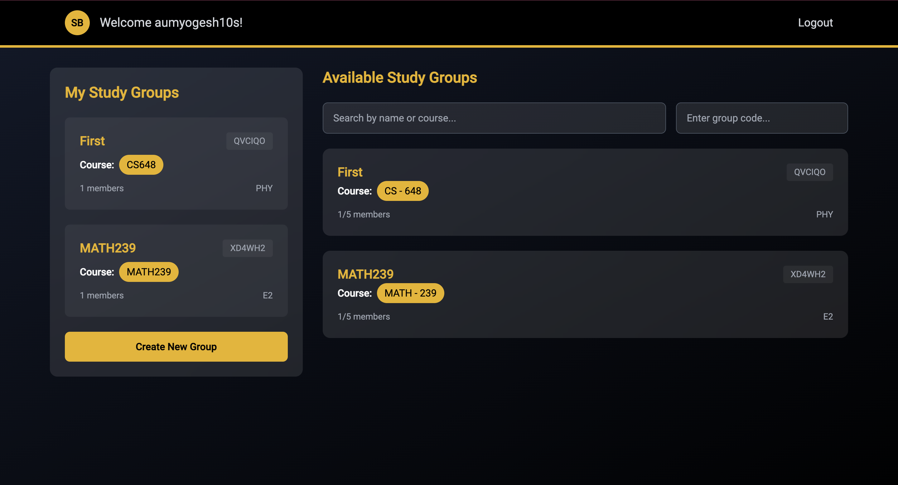
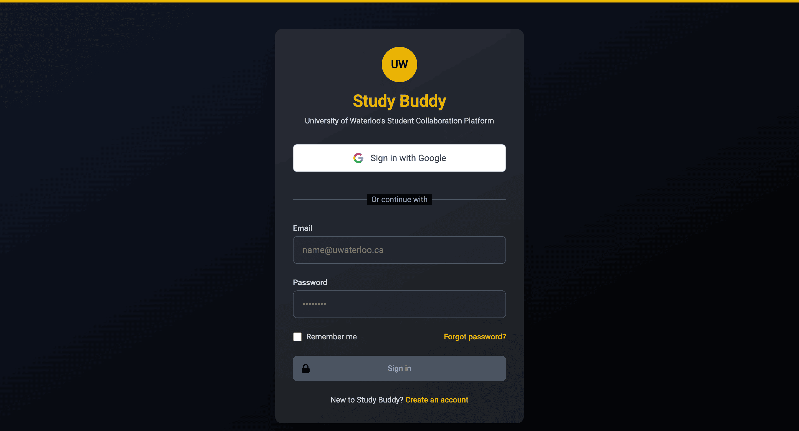
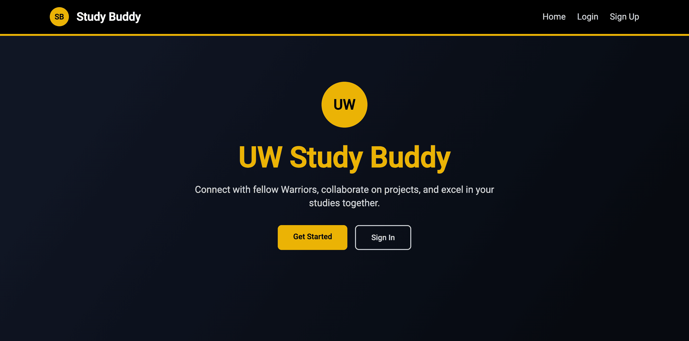
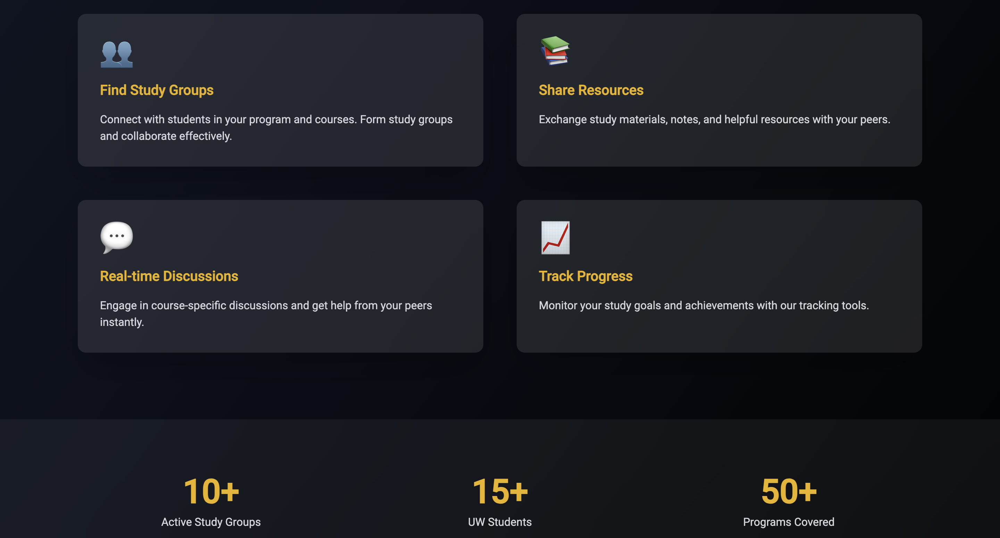

# Study Buddy

A collaborative study platform built with Angular that helps students connect and study together effectively.

## 📋 Prerequisites

- Node.js (v18 or higher)
- npm (comes with Node.js)
- Angular CLI (v19.1.2)

## 🚀 Getting Started

1. Clone the repository:
```bash
git clone [your-repository-url]
cd Studdy-Buddy-Angular-Project
```

2. Install dependencies:
```bash
npm install
```

3. Start the development server:
```bash
ng serve
```

4. Open your browser and navigate to `http://localhost:4200`

## 📸 Application Screenshots

### Landing Page

*Welcome to Study Buddy - Your Collaborative Learning Platform*

### Study Session Interface

*Interactive Study Session Environment*

### Dashboard View

*Personalized User Dashboard*

### Features Overview

*Comprehensive Platform Features*

## 🛠️ Built With

- Angular 19.1.2
- Angular Material
- TypeScript
- FireBase

## ✨ Key Features

- Real-time collaboration tools
- Interactive study session management
- User authentication and profiles
- Responsive design for all devices
- Session scheduling and management
- Resource sharing capabilities
- Progress tracking

## 🤝 Contributing

1. Fork the Project
2. Create your Feature Branch (`git checkout -b feature/NewFeature`)
3. Commit your Changes (`git commit -m 'Add some NewFeature'`)
4. Push to the Branch (`git push origin feature/NewFeature`)
5. Open a Pull Request

## 📫 Support

For support, please open an issue in the repository or contact the development team.

## 📝 License

This project is licensed under the MIT License - see the LICENSE file for details.